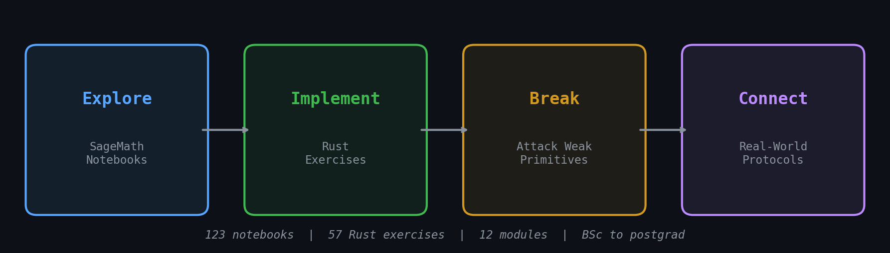
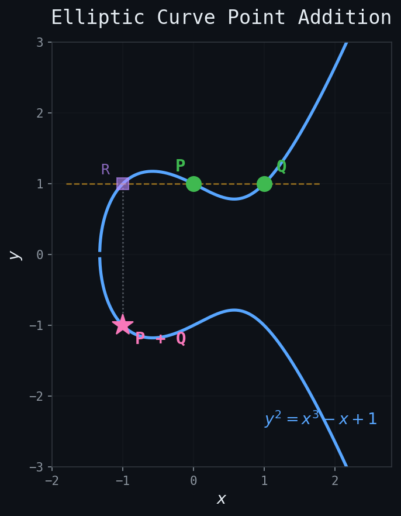

# Crypto From First Principles

[](../../actions/workflows/ci.yml)
[](LICENSE)
[](https://mybinder.org/v2/gh/duyuefeng0708/learn-cryptography/main)
[](https://github.com/duyuefeng0708/learn-cryptography/discussions)

**Learn cryptography by building it.** 123 interactive notebooks, 57 Rust exercises, 12 modules, from modular arithmetic to zero-knowledge proofs.

<p align="center">
  
</p>

## Why This Exists

Traditional crypto education either drowns you in pure math or hands you a library. We bridge the gap:

- **Explore** the math in SageMath. Visualize groups, curves, and lattices
- **Implement** every primitive from scratch in Rust. No magic black boxes
- **Break** weakened versions. See exactly why parameters matter
- **Connect** to real protocols. Find your math in TLS, Bitcoin, Signal, and Zcash

### How does this compare?

| | This Repo | Cryptopals | CryptoHack | MoonMath | Boneh (Stanford) |
|---|:---:|:---:|:---:|:---:|:---:|
| Interactive notebooks | 123 SageMath | none | web-only | PDF only | none |
| Math foundations | algebra to ZK | none | some | excellent | excellent |
| Build from scratch | Rust | Python | Python | none | none |
| Visualizations | plots + graphs | none | some | none | none |
| Attack labs | 27 notebooks | 48 challenges | 100+ challenges | none | none |
| Protocol connections | TLS, Bitcoin, Signal | none | none | Ethereum/ZK | none |
| Zero-install (Binder) | yes | no | yes (web) | no | no |
| Scope | groups to FHE/MPC | symmetric + PK | varied | algebra to ZK | broad theory |

<p align="center">
  
  &nbsp;&nbsp;
  
</p>

## Try It Now

**No install needed.** Launch in your browser:

[](https://mybinder.org/v2/gh/duyuefeng0708/learn-cryptography/main?labpath=foundations%2F01-modular-arithmetic-groups%2Fsage%2F01a-integers-and-division.ipynb)

Or clone locally:

```bash
git clone https://github.com/duyuefeng0708/learn-cryptography.git
cd learn-cryptography
conda activate sage
jupyter notebook foundations/01-modular-arithmetic-groups/sage/01a-integers-and-division.ipynb
```

## Modules

### Foundations (BSc)

| # | Module | What You'll Build | Notebooks |
|---|--------|-------------------|-----------|
| 01 | Modular Arithmetic & Groups | Cyclic groups, generators, Lagrange's theorem | 6 explore · 2 break · 2 connect |
| 02 | Rings, Fields & Polynomials | Ring axioms, polynomial rings, irreducibility | 6 explore · 2 break · 2 connect |
| 03 | Galois Fields & AES | GF(2^8), AES S-box, MixColumns | 6 explore · 2 break · 2 connect |
| 04 | Number Theory & RSA | Euler/Fermat, CRT, RSA from scratch | 6 explore · 3 break · 2 connect |
| 05 | Discrete Log & Diffie-Hellman | DLP, CDH, DDH, key exchange | 6 explore · 3 break · 2 connect |
| 06 | Elliptic Curves | Point addition, ECDH, ECDSA | 6 explore · 3 break · 3 connect |

### Frontier (Postgraduate)

| # | Module | What You'll Build | Notebooks |
|---|--------|-------------------|-----------|
| 07 | Bilinear Pairings | Weil/Tate pairing, BLS signatures, IBE | 5 explore · 2 break · 2 connect |
| 08 | Lattices & Post-Quantum | LWE, Ring-LWE, Kyber overview | 6 explore · 2 break · 2 connect |
| 09 | Commitments & Sigma Protocols | Pedersen, Schnorr, Fiat-Shamir | 5 explore · 2 break · 2 connect |
| 10 | SNARKs & STARKs | R1CS, QAP, Groth16, FRI | 5 explore · 2 break · 3 connect |
| 11 | Homomorphic Encryption | BGV, BFV, CKKS | 5 explore · 2 break · 3 connect |
| 12 | Multi-Party Computation | Secret sharing, Yao's GC, SPDZ | 5 explore · 2 break · 3 connect |

## How to Work Through a Module

Each module has its own `README.md` with prerequisites, learning objectives, and a detailed roadmap.

**1. Explore.** Work through the SageMath notebooks in order (a, b, c, ...). Run every cell, modify examples, answer the exercises.

**2. Implement.** Open `rust/src/lib.rs` and replace `todo!()` with your code. Early modules give loop skeletons; later modules give only function signatures.
```bash
cargo test -- --ignored    # Run all exercises in this module
```

**3. Break.** Attack weakened versions of what you just built. See why small keys, nonce reuse, and bad parameters are fatal.

**4. Connect.** Trace your math to real protocols. Find your group theory in TLS, your curves in Bitcoin, your pairings in Ethereum.

<details>
<summary><strong>Installation (local setup)</strong></summary>

### Prerequisites

- **Rust** >= 1.75
- **SageMath** >= 10.0 (via conda)
- **Jupyter** with SageMath kernel

### Linux (Ubuntu/Debian)

```bash
# Rust
curl --proto '=https' --tlsv1.2 -sSf https://sh.rustup.rs | sh
source ~/.cargo/env

# SageMath + Jupyter (via Miniforge)
curl -L -O "https://github.com/conda-forge/miniforge/releases/latest/download/Miniforge3-Linux-x86_64.sh"
bash Miniforge3-Linux-x86_64.sh
source ~/miniforge3/etc/profile.d/conda.sh
conda create -n sage sage jupyter -c conda-forge
conda activate sage

# Register SageMath kernel (visible to VS Code / JupyterLab outside the env)
python -m sage.repl.ipython_kernel.install --user

# Verify
rustc --version
jupyter kernelspec list   # should show "sagemath"
```

### macOS

```bash
# Rust
curl --proto '=https' --tlsv1.2 -sSf https://sh.rustup.rs | sh
source ~/.cargo/env

# SageMath + Jupyter (via Miniforge)
curl -L -O "https://github.com/conda-forge/miniforge/releases/latest/download/Miniforge3-MacOSX-$(uname -m).sh"
bash Miniforge3-MacOSX-$(uname -m).sh
source ~/miniforge3/etc/profile.d/conda.sh
conda create -n sage sage jupyter -c conda-forge
conda activate sage

# Register SageMath kernel
python -m sage.repl.ipython_kernel.install --user

# Verify
rustc --version
jupyter kernelspec list
```

### Windows

```powershell
# Rust: download and run the installer from https://rustup.rs

# SageMath + Jupyter (via Miniforge)
# Download Miniforge3-Windows-x86_64.exe from:
#   https://github.com/conda-forge/miniforge/releases/latest
# Run the installer, then open Miniforge Prompt:

conda create -n sage sage jupyter -c conda-forge
conda activate sage

# Register SageMath kernel
python -m sage.repl.ipython_kernel.install --user

# Verify
rustc --version
jupyter kernelspec list
```

### VS Code Setup

Install the [Jupyter](https://marketplace.visualstudio.com/items?itemName=ms-toolsai.jupyter) extension, then connect to a SageMath Jupyter server:

1. Start the server (inside the conda env):
   ```bash
   conda activate sage
   sage -n jupyter
   ```
2. Copy the URL with token from the terminal output (e.g. `http://localhost:8888/?token=abc123...`).
3. In VS Code, open any `.ipynb`, click **Select Kernel**, then **Existing Jupyter Server**, and paste the URL.
4. Select the **SageMath** kernel from the list.

The server stays running. You only need to do steps 2 through 4 once per session.

</details>

## Roadmap

- [x] SageMath exploration notebooks (72 notebooks across 12 modules)
- [x] Scaffolded Rust exercises (57 functions with progressive difficulty)
- [x] Break/connect notebooks (55 notebooks across 12 modules)
- [x] Binder integration for zero-install browser experience
- [ ] Community-contributed exercises and visualizations

## Contributing

See [CONTRIBUTING.md](CONTRIBUTING.md) for guidelines on reporting issues, adding content, and submitting PRs.

## License

MIT
